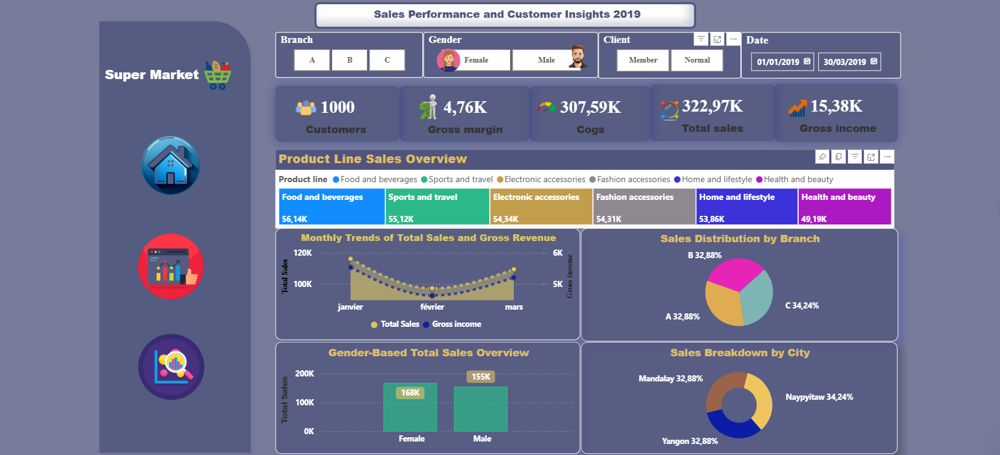
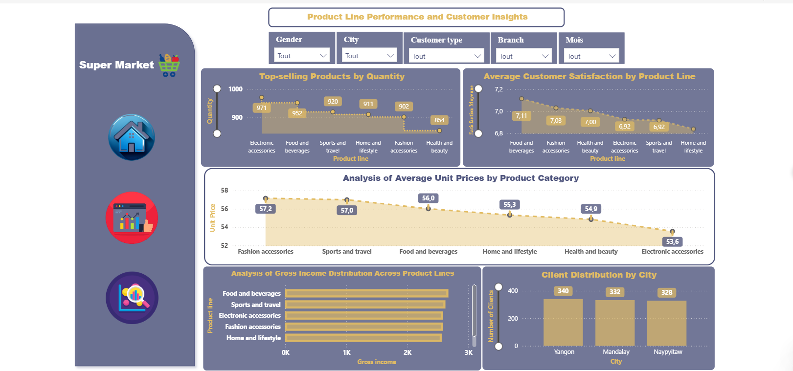
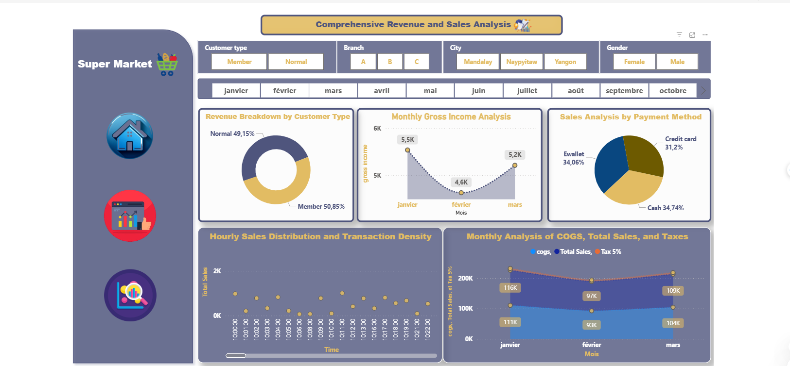

# Sales Analysis – Supermarket

## Project Description

This project aims to analyze the sales of a supermarket through an interactive dashboard. It explores the impact of various factors such as product prices, quantities sold, and payment methods on sales performance. The dashboard provides real-time insights, facilitating strategic decision-making to improve business performance.

## Main Features
- **Sales analysis by product, quantities sold, and payment methods.**
- **Calculation and tracking of KPIs:** Total sales, gross margins, and other key performance indicators.
- **Dynamic filters** to explore data based on criteria such as city, customer type, product, etc.
- **Interactive visualizations** with Power BI for quick decision-making.

## Objectives
- Optimize pricing and stock strategies.
- Analyze consumption trends and the impact of promotions.
- Improve sales and stock management based on data.

## Technologies Used
- **Power BI** for creating interactive dashboards.
- **DAX** for advanced calculations and KPIs.
- **Power Query** for data extraction and transformation.
- **Excel** for data preprocessing and analysis.

## Dashboard Pages

### Page 1: Sales Performance and Customer Insights 2019


This page provides detailed insights into the sales performance in 2019, along with customer behavior insights.

### Page 2: Product Line Performance and Customer Insights


Explore the performance of product lines and the impact of different product types on sales and revenue.

### Page 3: Comprehensive Revenue and Sales Analysis


A comprehensive analysis of revenue and sales, providing an overview of key consumption trends.

## Installation
1. Clone the repository:  
```bash
git clone https://github.com/raniasouissi/Sales-Analysis-Supermarket/.git

